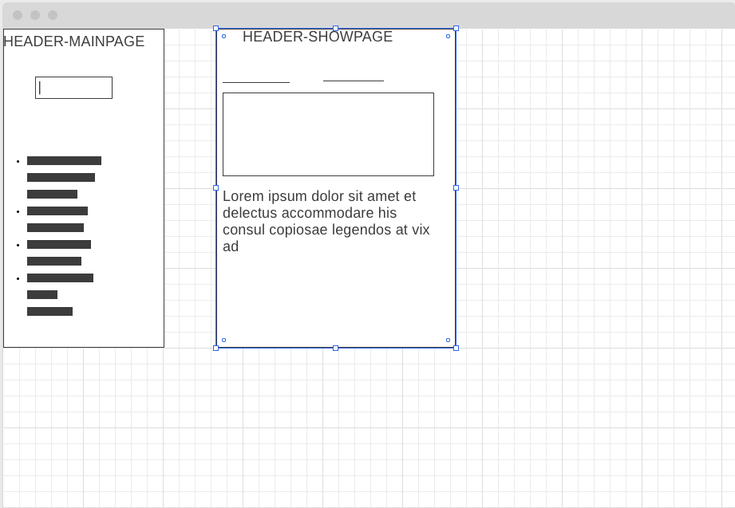
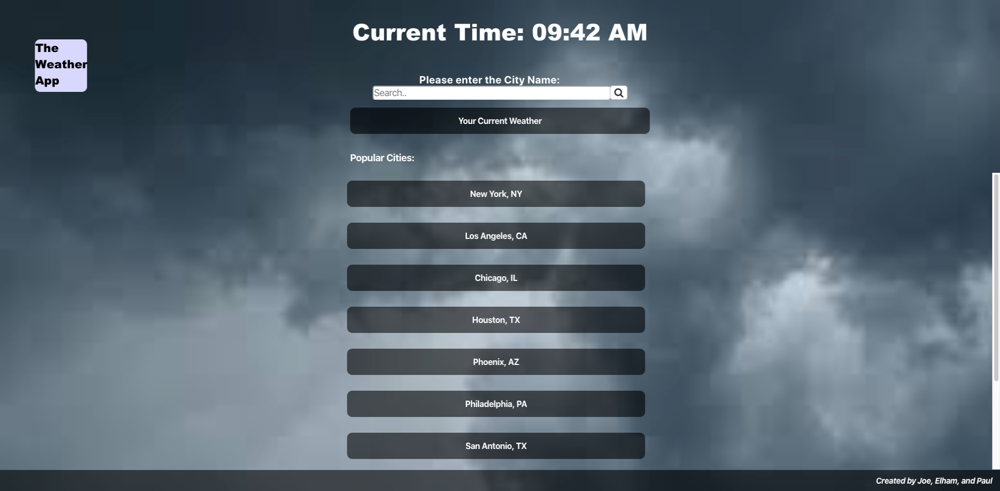
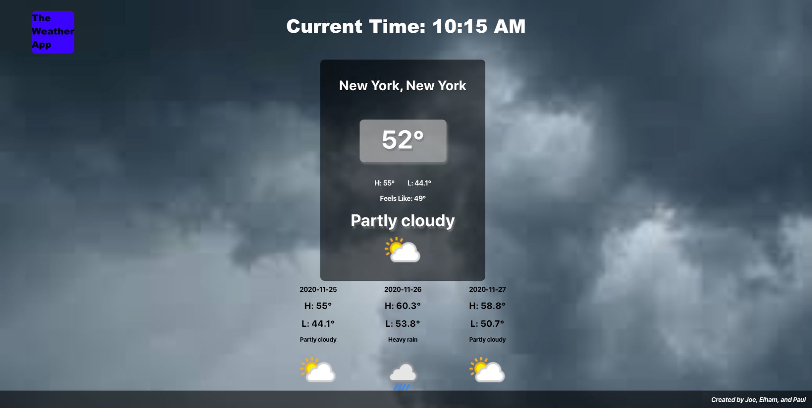

# Weather App

## Description  

Our weather app shows the current weather of any city the user types in and a 3 day forecast, as well.

## Project Links

* [Github Repo](https://github.com/PaulDSink/Weather-App)
* [Deployment](https://weather-app-sink-hovanec-azizi.herokuapp.com/)

## Approach  

We first began this project with the goal of creating our minimum viable product(MVP) and then adding on our post MVP goals.

### MVP

For MVP, we wanted to create a home page with links for large U.S. cities and a show page that rendered the current forecast for a specific city from a weather api. We used http://www.weatherapi.com/.

### Post MVP  

For post MVP, we wanted to work on cleaning up our styling and add a three day forecast as well as a map feature to our show page. The static map feature is easily integrable using the Google Maps API which is then adjusted to the location of the weather. Additionally, we wanted to add functionality that would use your IP to enable a current location weather forecast. In order to to do this we used the API at https://api.ipgeolocation.io. 

### Unsolved Problems  

When rendering the show page, the API request can take longer so the information on the page changes once the API request is finished. Also, sometimes the API request doesn't complete and the information rendered on the show page is the last city searched instead of the current city.

### Wireframe  

## Example  

Above is an example of the functionality of my application.

## Technologies Used  

We used the following technologies on this project:
* React
* JavaScript
* Axios
* CSS 3

## Contribution  

Source code: [click here](https://github.com/PaulDSink/Weather-App)  
Issue reporting: [click here](https://github.com/PaulDSink/Weather-App/issues)